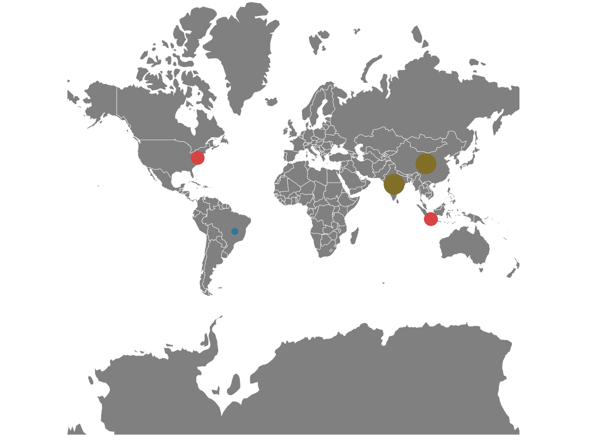

# How to show the bubble markers in the specific latitude and longitude in Xamarin.Forms Map (SfMaps)
This article explains how to add the bubble marker in a specific latitude and longitude in Xamarin.Forms Syncfusion maps control with the following steps.

Step 1: Initialize the SfMaps control and add the ShapeFile layer to the layer collection of the SfMaps control with Uri property to retrieve the location of ShapeFile.

[XAML]

```
<maps:SfMaps  x:Name="Maps" >
        <maps:SfMaps.Layers >
            <maps:ShapeFileLayer Uri="world1.shp">

               …

            </maps:ShapeFileLayer>
        </maps:SfMaps.Layers>
    </maps:SfMaps>
```
Step 2: Create a custom marker by extending the MapMarker and add the custom markers with latitude, longitude, and population values to the shape file layer using the Markers property. And you can define the own marker style using the MarkerTemplate property of ShapeFileLayer as shown in the following code.

[XAML]

```
<maps:SfMaps  x:Name="Maps" >
        <maps:SfMaps.Layers >
            <maps:ShapeFileLayer Uri="world1.shp" Markers="{Binding CustomMarkers}" >
                <maps:ShapeFileLayer.ShapeSettings>
                    <maps:ShapeSetting ShapeFill="Gray" />
                </maps:ShapeFileLayer.ShapeSettings>
                <maps:ShapeFileLayer.MarkerTemplate>
                    <DataTemplate>
                        <BoxView x:Name="boxView"
                                 CornerRadius="{Binding .,Converter={x:StaticResource TemplateConverter},ConverterParameter={x:Reference boxView},Mode=TwoWay}" 
                                 BackgroundColor="LightBlue"/>
                    </DataTemplate>
                </maps:ShapeFileLayer.MarkerTemplate>
            </maps:ShapeFileLayer>
        </maps:SfMaps.Layers>
    </maps:SfMaps>
```
[C#]

```
    public class ViewModel
    {
        public ObservableCollection<MapMarker> CustomMarkers { get; set; }
        public ViewModel()
        {         
            CustomMarkers = new ObservableCollection<MapMarker>();
            CustomMarkers.Add(new CustomMarker() { Label = "United States", Latitude = "38.8833", Longitude = "-77.0167", Population = 321174000 });
            CustomMarkers.Add(new CustomMarker() { Label = "Brazil", Latitude = "-15.7833", Longitude = "-47.8667", Population = 204436000 });
            CustomMarkers.Add(new CustomMarker() { Label = "India", Latitude = "21.0000", Longitude = "78.0000", Population = 1272470000 });
            CustomMarkers.Add(new CustomMarker() { Label = "China", Latitude = "35.0000", Longitude = "103.0000", Population = 1370320000 });
            CustomMarkers.Add(new CustomMarker() { Label = "Indonesia", Latitude = "-6.1750", Longitude = "106.8283", Population = 255461700 });
        }
    }
    public class CustomMarker : MapMarker
    {
        public ImageSource ImageName { get; set; }
        public double Population { get; set; }
        public CustomMarker()
        {
            ImageName = ImageSource.FromResource("MapMarker_Collection.pin.png", typeof(CustomMarker).GetTypeInfo().Assembly);
        }
    }
```
Step 3: Using converter to define the size of the BoxView as per the value of the Population property in CustomMarker class.

[XAML]

```
         …

                <maps:ShapeFileLayer.MarkerTemplate>
                    <DataTemplate>
                        <BoxView x:Name="boxView"
                                 CornerRadius="{Binding .,Converter={x:StaticResource TemplateConverter},ConverterParameter={x:Reference boxView},Mode=TwoWay}" 
                                 BackgroundColor="LightBlue"/>
                    </DataTemplate>
                </maps:ShapeFileLayer.MarkerTemplate>

       …
```

[C#]

```
    public class TemplateConverter : IValueConverter
    {
        public object Convert(object value, Type targetType, object parameter, CultureInfo culture)
        {
            if (value != null)
            {
                var population = (value as CustomMarker).Population;

                var isLowRange = population < 250000000;

                var isMiddleRange = population >= 250000000 && population < 400000000;

                double radius = isLowRange ? 5 : isMiddleRange ? 10 : 15; 

                (parameter as BoxView).HeightRequest = (parameter as BoxView).WidthRequest = radius * 2;
                (parameter as BoxView).BackgroundColor = radius == 5 ? Color.FromHex("#2E769F") : (radius == 10) ? Color.FromHex("#D84444") : Color.FromHex("#816F28");
                return radius;                    
            }

            return 0;
        }

        public object ConvertBack(object value, Type targetType, object parameter, CultureInfo culture)
        {
            return value;
        }
    }
```
# Output


 
# See also

[How to add different style marker pins to Xamarin.Forms SfMaps](https://www.syncfusion.com/kb/11372/how-to-add-different-style-marker-pins-to-xamarin-forms-maps-sfmaps)

[How to add SfMap markers dynamically to the tapped location](https://www.syncfusion.com/kb/10550/how-to-add-map-markers-dynamically-to-the-tapped-location)

[How to group the markers based on zoom level in the imagery layer of the SfMaps control](https://www.syncfusion.com/kb/10200/how-to-group-the-markers-based-on-zoom-level-in-the-imagery-layer-of-the-sfmaps-control)

